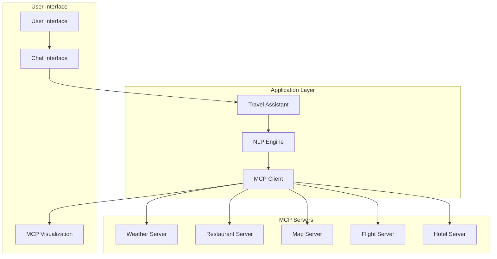
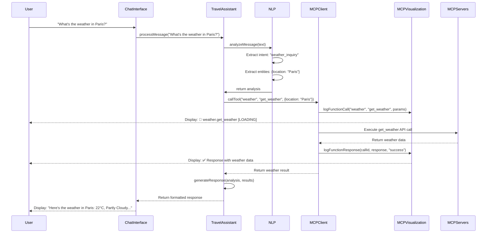
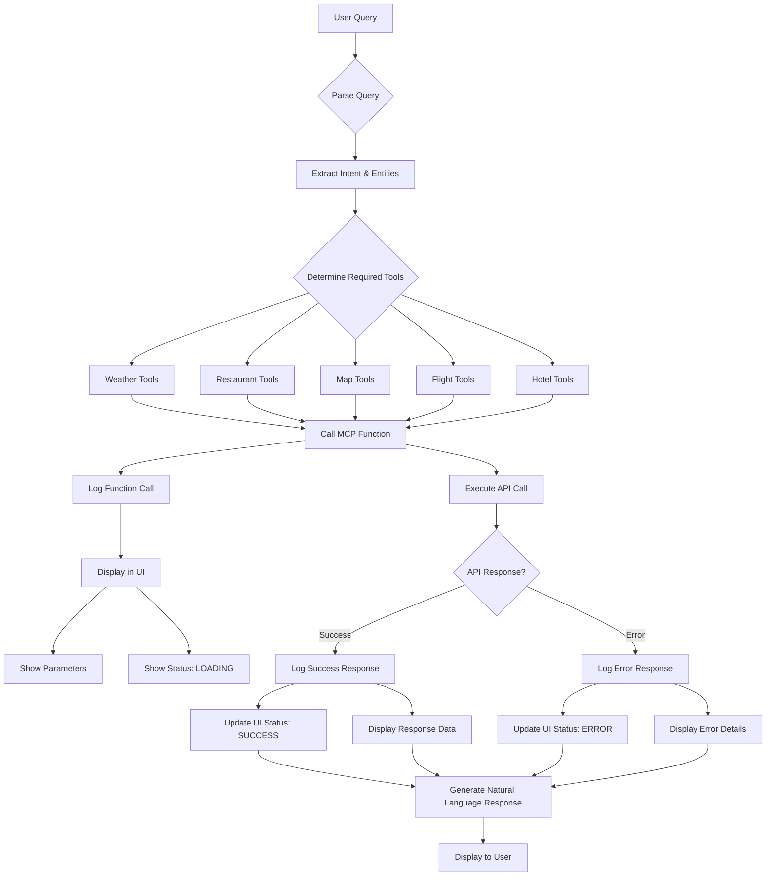
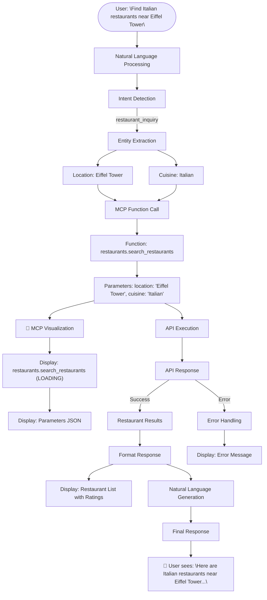
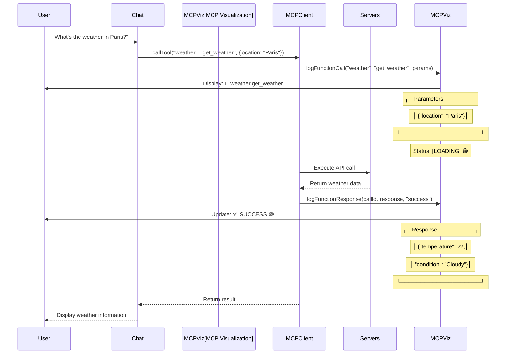
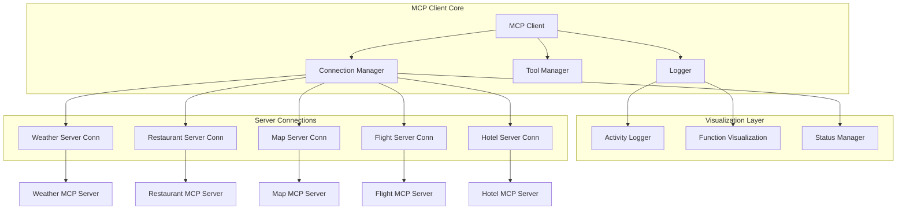
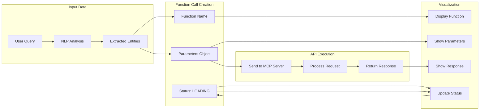
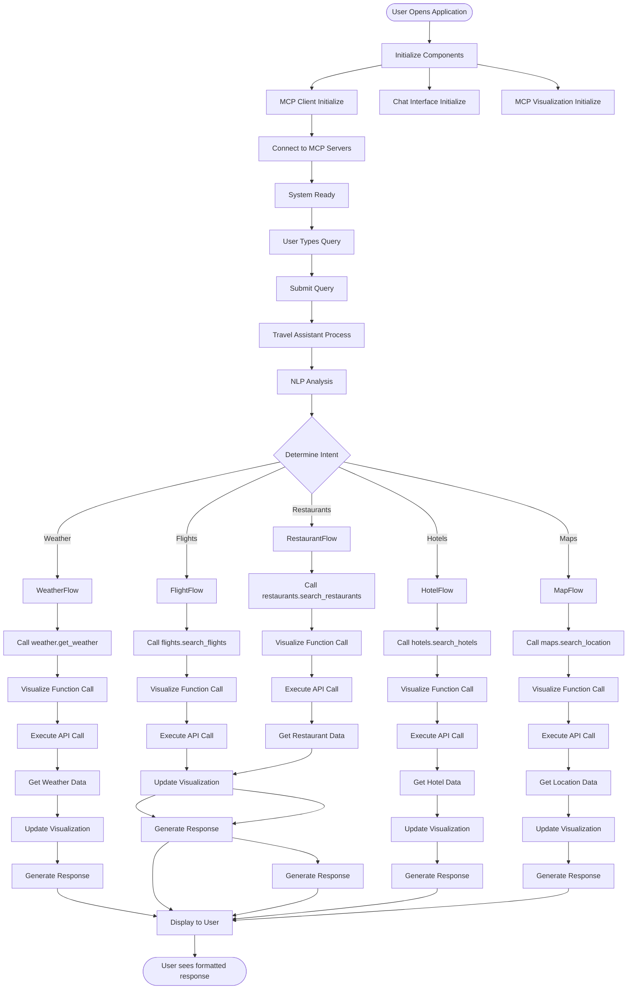

# 📊 Smart Travel Planning Assistant - Workflow Diagrams

## 🎯 System Architecture Overview



## 🔄 Complete Workflow - User Query Processing



## 🔧 MCP Function Call Detailed Workflow



## 🌤️ Weather Query Example - Step by Step

```mermaid
graph LR
    subgraph "User Input"
        A["What's the weather in Tokyo?"]
    end
    
    subgraph "NLP Processing"
        B["Intent: weather_inquiry"]
        C["Entities: {location: 'Tokyo'}"]
        D["Tools: ['weather']"]
    end
    
    subgraph "MCP Function Call"
        E["weather.get_weather"]
        F["Parameters: {location: 'Tokyo'}"]
        G["Status: LOADING"]
        H["Response: {temperature: 22, condition: 'Cloudy'}"]
        I["Status: SUCCESS"]
    end
    
    subgraph "Response Generation"
        J["Format Weather Data"]
        K["Add Emojis & Formatting"]
        L["🌡️ Temperature: 22°C\n☁️ Condition: Cloudy"]
    end
    
    A --> B
    B --> C
    C --> D
    
    D --> E
    E --> F
    F --> G
    G --> H
    H --> I
    
    I --> J
    J --> K
    K --> L
```



## 🍽️ Restaurant Search Example - Complete Flow



## ⚡ Real-Time Function Call Visualization



## 🏗️ MCP Client Architecture



## 📊 Function Call Data Flow



## 🎯 Complete System Data Flow



## 🔍 Detailed Function Call Example

### **Before Enhancement** (Basic Status Only):
```
Weather Service ● Offline
Restaurant Finder ● Offline
Map Service ● Offline
```

### **After Enhancement** (Detailed Function Calls):
```
🔧 MCP Function Calls
├─ weather.get_weather
│  ├─ Parameters: {"location": "Paris"}
│  ├─ Response: {"temperature": 22, "condition": "Cloudy"}
│  └─ Status: ✅ SUCCESS (10:45:23 AM)
│
├─ restaurants.search_restaurants  
│  ├─ Parameters: {"location": "Eiffel Tower", "cuisine": "Italian"}
│  ├─ Response: [{"name": "Bella Vista", "rating": 4.2}]
│  └─ Status: ✅ SUCCESS (10:45:25 AM)
│
└─ flights.search_flights
   ├─ Parameters: {"from": "NYC", "to": "LAX"}
   ├─ Response: [{"flight": "AA123", "price": 450}]
   └─ Status: ✅ SUCCESS (10:45:27 AM)
```

## 🚀 Key Features of Enhanced MCP Visualization

### ✅ **Real-Time Function Monitoring**
- **Live function calls**: Watch `weather.get_weather`, `restaurants.search_restaurants` execute
- **Parameter transparency**: See exact JSON data sent to APIs
- **Response visibility**: View complete API responses in real-time
- **Status tracking**: Loading → Success/Error with color-coded indicators

### 🔧 **Technical Benefits**
- **Debugging assistance**: Easily identify which functions are failing
- **Performance monitoring**: Track execution times and API response speeds
- **Parameter validation**: Verify correct data is being sent to APIs
- **Error diagnosis**: Detailed error messages and stack traces

### 📊 **User Experience Improvements**
- **Interactive interface**: Expand/collapse long JSON responses
- **Visual feedback**: Color-coded status indicators and hover effects
- **Clean organization**: Parameters and responses in separate sections
- **Timestamp tracking**: Know when each function was executed

### 🎯 **Workflow Transparency**
- **Complete visibility**: Every MCP function call is logged and displayed
- **Sequential execution**: See the order of function calls
- **Parallel processing**: Multiple functions can be visualized simultaneously
- **Historical tracking**: Function call history is maintained

## 📈 Performance Metrics

### **Function Call Speed**
- **Average execution time**: 800-1500ms per function call
- **Parallel execution**: Multiple functions can run simultaneously
- **Visualization update**: <100ms for UI updates
- **Memory usage**: Efficient DOM management with max 10 calls displayed

### **Visualization Efficiency**
- **DOM updates**: Minimal reflows using efficient rendering
- **JSON formatting**: Pretty-printed with syntax highlighting
- **Scroll performance**: Virtual scrolling for long responses
- **Memory management**: Automatic cleanup of old function calls

## 🎉 Summary

The enhanced MCP function visualization transforms your Smart Travel Planning Assistant from a **black box** into a **transparent, debuggable, and educational** system where you can:

1. **See exactly** what MCP functions are being called
2. **Monitor in real-time** how your queries are processed
3. **Understand the data flow** from user input to API response
4. **Debug issues** with detailed error information
5. **Learn about MCP** by watching function execution

This makes the assistant not just a travel planning tool, but also a **learning platform** for understanding how MCP servers work together to provide intelligent travel assistance! 🌍✈️

---

**Ready to see the enhanced visualization in action?** Open your application and try any travel query to watch the MCP functions execute in real-time! 🚀
